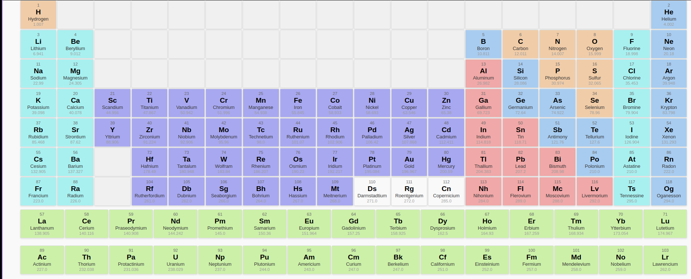

# Chemické prvky \[ Naše Chemická Romance ;-\) \]

## Cíl projektu
Cílem tohoto projektu je vytvořit konzolovou aplikaci v jazyce Python, která umožní uživatelům interagovat s databází chemických prvků.

## Autoři projektu
### [Ondřej Honus](https://github.com/ondrejhonus)
### [Walter Oboňa](https://github.com/Dvojak)

## Funkcionalita programu
- **Načítání dat**: Import dat z CSV souboru do vhodné datové struktury v Pythonu.
- **Symbolické menu**: Opakovaný výběr z různých předvoleb v rámci konzolové aplikace.
- **Vyhledávání prvků**: Možnost vyhledávání prvku podle různých kritérií (např. značka, název, protonové číslo, skupina, perioda).
- **Zobrazení vlastností**: Zobrazení všech vlastností vybraného prvku.
- **Výpočet průměrné hmotnosti**: Výpočet průměrné relativní atomové hmotnosti prvků ve vybrané skupině nebo periodě.
- **Generování HTML tabulky**: Vytvoření HTML tabulky se seznamem všech prvků a jejich základními vlastnostmi.
- **Export do JSON**: Export vybraných dat do JSON souboru.
- **Export do XML**: Export vybraných dat do XML souboru.
- **Markdown přehled**: Vytvoření Markdown souboru s přehledem prvků v konkrétní skupině nebo periodě.

## Periodická tabulka

## Jak spustit aplikaci
1. Naklonujte tento repozitář: `git clone https://github.com/ondrejhonus/our-chemical-romance`
3. Spusťte aplikaci: `python main.py`
